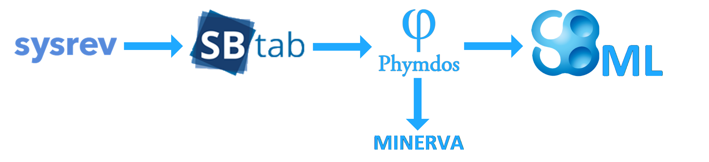

Phymdos   The ONTOX Physiological Maps documentation software
============================================================

This application was created to serve as a bridge between [sysrev.com](https://sysrev.com/) and [Celldesigner](http://www.celldesigner.org/). Its core functionality is to allow the user to easily create SBML style physiological maps from literature by filling out easy to use data tables and converting them to the desired format by the click of a button. 
The format used to create these data tables is SBtab, which is essentially a .tsv file containing several tables that together define a system. These tables can be filled out on sysrev.com and in this app and can then be converted to SBML files which can be used by Celldesigner to build physiological maps. This workflow has been illustrated below.  
 

<ol>
  <li>
  Upon opening the app, users will first be guided to the home screen where they are presented with 3 choices. 
  </li>
   
  
  
  <ol type=a>
    <li> 
      Create new SBtab:  
      Creating a new SBtab will allow users to create their own SBtab from scratch. (Continues from point 3)
      </li>
    <li> 
      Upload an SBtab object:  
      Uploading an SBtab object will allow users to upload a .tsv containing an SBtab document. The tabs within the .tsv will be opened in the app.
      </li>
    <li>
      Upload an SBML object:  
      Uploading an SBML object will allow users to upload a .xml containing an SBML document. The SBML will be converted to SBtab and the tabs within the SBtab will be opened in the app.
      </li>
   </ol>
   
  <li>
    Upon clicking one of the uploading options, users will be presented an uploading screen in which they can upload either a .tsv file for SBtab or a .xml file for SBML. 
  </li>
   
  
  
  
  <li>
  Once the upload is complete and the continue button is clicked the app will open the tables corresponding to the upload file, and users will be redirected to the first setup where they can enter a name for the document and choose a SBtab version (change only if needed, the newest version is standard).
  </li>
   
  
  
  
  <li>
    Clicking 'save input' will redirect users to the 'select tables' tab which can also be accessed from the menu on the left side of the screen. Here users can add or remove tables from the menu. The app currently only features the three most important table types. Please also note that removing a table from the menu does <b>NOT</b> delete any data that is inside the table.
  </li>
   
  
  
  
  <li>
    Once all the correct tables are selected users can start filling the new tables or start adding to the uploaded tables however they see fit. 
  </li>
    
  
  
  
  For empty tables the first step is to start adding columns to the table. This can also be done on existing tables to add information.
   
  
  
    
  To find out what columns, users can view the description of table elements found at the bottom of the page.
   
  
  
  
  <li> 
    When users are done filling out the tables they can go to the download screen by clicking the button underneath the table or they can click Setup on the menu on the left. Here they can export the file to SBtab- and SBML format. 
  </li>
   
  
  
  
</ol>
